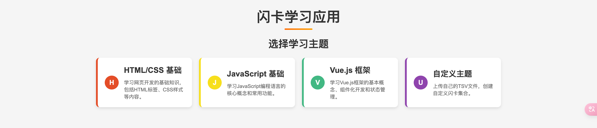
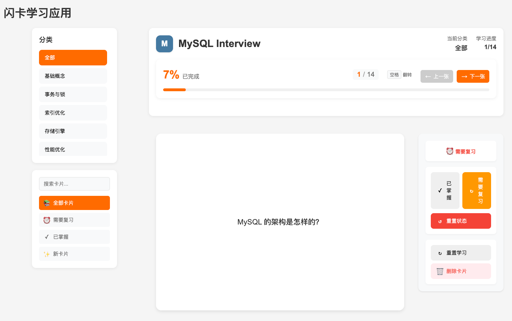

# Vue 3 闪卡学习应用

一个使用 Vue 3 构建的交互式闪卡学习应用，通过 TSV 文件加载闪卡内容，支持多主题学习和自定义闪卡。





## 核心功能

- **多主题学习**：预设多个学习主题，每个主题有独特的视觉标识
- **自定义闪卡**：支持上传自定义 TSV 文件创建个性化闪卡集
- **智能进度跟踪**：自动记录学习进度，支持中断后继续学习
- **交互式学习**：点击卡片翻转查看答案，支持键盘快捷键
- **响应式设计**：浏览器模式

## 快速开始

### 本地运行

1. 克隆仓库：
   ```bash
   git clone https://github.com/yourusername/flashcard-web.git
   cd flashcard-web
   ```

2. 安装依赖：
   ```bash
   npm install
   ```

3. 启动开发服务器：
   ```bash
   npm run dev
   ```

4. 访问 `http://localhost:5173`

## 使用指南

### 开始学习

1. 在主页选择学习主题或上传自定义 TSV 文件
2. 点击卡片翻转查看答案
3. 使用键盘快捷键快速导航：
   - 左箭头：上一张卡片
   - 右箭头：下一张卡片
   - 空格键/回车键：翻转卡片

### 创建自定义闪卡

1. 准备 TSV 格式文件：
   ```
   category question	answer
    类型 问题1	答案1
    类型 问题2	答案2
   ```
2. 在主页选择"自定义主题"并上传文件

### 学习进度

- 自动保存学习进度，包括：
  - 当前主题和卡片位置
  - 已查看的卡片
  - 上次学习时间
- 在主题卡片上显示学习进度条
- 支持随时继续上次的学习

## 项目结构

```
flashcard_web/
├── src/                # 源代码
│   ├── components/     # 组件
│   ├── views/          # 页面视图
│   ├── router/         # 路由配置
│   └── stores/         # 状态管理
└── themes/             # 主题目录
    ├── index.json      # 主题索引
    └── [主题名]/       # 各主题目录
        ├── meta.json   # 主题配置
        └── cards.tsv   # 闪卡内容
```

## 技术栈

- Vue 3 + Composition API
- Pinia 状态管理
- Vue Router
- Vite
- TypeScript

## 浏览器支持

- Chrome 60+
- Firefox 55+
- Safari 11+
- Edge 79+

## 贡献

欢迎提交 Pull Request 或创建 Issue！

## 许可证

MIT License

## 联系方式

- 电子邮件：muzig012046@gmail.com
