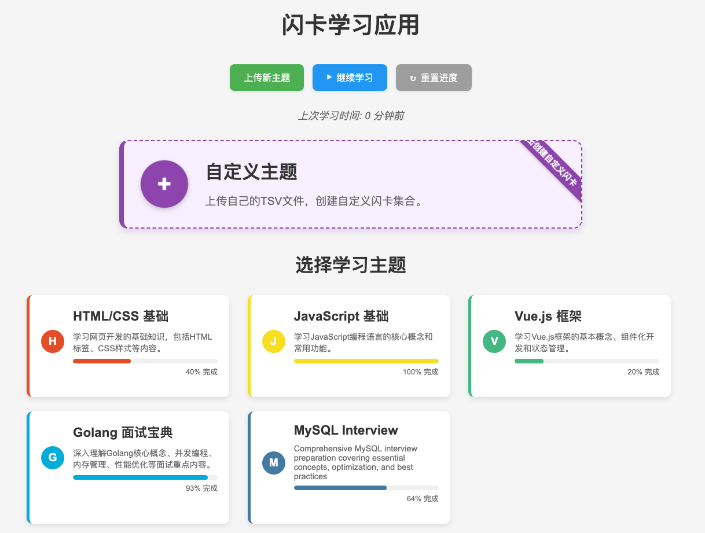

# Vue 3 闪卡学习应用

一个使用 Vue 3 构建的交互式闪卡学习应用，通过 TSV 文件加载闪卡内容，支持多主题学习和自定义闪卡。



## 功能特点

- **Vue 3 技术栈**：使用 Vue 3 的 Composition API 构建
- **主题化学习**：预设多个学习主题，每个主题有独特的视觉标识
- **TSV 配置文件**：通过 TSV 文件加载闪卡内容，易于编辑和扩展
- **交互式卡片**：点击卡片翻转查看答案，键盘快捷键支持
- **自定义内容**：支持上传自定义 TSV 文件创建个性化闪卡集
- **学习进度跟踪**：自动记录学习进度，支持中断后继续学习
- **进度可视化**：直观展示每个主题的学习完成度
- **响应式设计**：适配桌面和移动设备
- **无需构建**：使用 CDN 引入 Vue 3，无需本地安装 Node.js

## 快速开始

<!-- 
### 在线使用

访问 [在线演示](https://example.com/flashcard-app) 直接使用应用。 -->

### 本地运行

1. 克隆仓库：
   ```bash
   git clone https://github.com/yourusername/flashcard-web.git
   cd flashcard-web
   ```

2. 使用任意 HTTP 服务器启动应用：
   ```bash
   # 使用 Python 内置 HTTP 服务器
   python -m http.server 8000
   
   # 或使用 Node.js http-server (需要先安装)
   npx http-server
   ```

3. 在浏览器中访问：
   ```
   http://localhost:8000
   ```

## 使用指南

### 选择学习主题

1. 在主页上查看可用的学习主题
2. 点击任意主题卡片开始学习
3. 或选择"自定义主题"上传自己的 TSV 文件
4. 如果有上次学习记录，可以点击"继续学习"按钮继续上次的学习进度

### 使用闪卡

1. 点击卡片翻转查看答案
2. 使用"上一张"和"下一张"按钮或键盘左右箭头键导航
3. 使用空格键或回车键翻转卡片
4. 点击"返回主题选择"按钮返回主页
5. 学习进度会自动保存，下次可以继续上次的学习

### 创建自定义闪卡

1. 在主页选择"自定义主题"
2. 准备一个 TSV 格式的文件，格式如下：
   ```
   question	answer
   问题1	答案1
   问题2	答案2
   ```
3. 点击"选择文件"按钮上传 TSV 文件
4. 上传成功后自动加载闪卡内容

## 键盘快捷键

- **左箭头**：上一张卡片
- **右箭头**：下一张卡片
- **空格键/回车键**：翻转卡片

## 学习进度跟踪

### 进度保存

- 应用会自动记录您的学习进度，包括：
  - 当前学习的主题
  - 当前查看的卡片位置
  - 已查看过的卡片
  - 上次学习的时间

### 继续学习

1. 在主页上点击"继续学习"按钮
2. 应用将自动加载上次学习的主题和卡片位置

### 进度可视化

- 在主题卡片上显示学习进度条，直观展示完成百分比
- 在学习界面上方显示当前主题的总体学习进度

### 重置进度

- 如果需要重新开始，可以点击"重置进度"按钮清除所有学习记录

## 文件结构

```
flashcard_web/
│
├── index.html          # 主HTML文件，包含Vue模板
├── app.js              # Vue应用逻辑
├── styles.css          # 应用样式
│
└── themes/             # 主题目录
    ├── index.json      # 主题索引文件，列出所有可用主题
    │
    ├── html/           # HTML主题目录
    │   ├── meta.json   # 主题元数据（名称、描述、颜色等）
    │   └── cards.tsv   # 主题闪卡内容（TSV格式）
    │
    ├── javascript/     # JavaScript主题目录
    │   ├── meta.json   # 主题元数据
    │   └── cards.tsv   # 主题闪卡内容
    │
    └── vue/            # Vue主题目录
        ├── meta.json   # 主题元数据
        └── cards.tsv   # 主题闪卡内容
```

## 添加新主题

1. 在 `themes` 目录下创建新的主题目录，如 `themes/react/`
2. 在主题目录中创建 `meta.json` 文件，定义主题元数据：
   ```json
   {
     "id": "react",
     "name": "React 框架",
     "description": "学习React框架的基本概念和组件开发。",
     "icon": "react",
     "color": "#61dafb",
     "cards": "cards.tsv"
   }
   ```
3. 创建 `cards.tsv` 文件，包含闪卡内容：
   ```
   question	answer
   什么是React?	React是一个用于构建用户界面的JavaScript库。
   什么是JSX?	JSX是JavaScript的语法扩展，允许在JavaScript中编写类似HTML的代码。
   ```
4. 在 `themes/index.json` 中添加新主题的引用：
   ```json
   {
     "themes": [
       // 其他主题...
       {
         "id": "react",
         "path": "react/meta.json"
       }
     ]
   }
   ```

## TSV 文件格式

TSV（Tab-Separated Values）是一种简单的文本格式，使用制表符分隔值：

```
question	answer
问题1	答案1
问题2	答案2
```

注意事项：
- 第一行必须是标题行，包含 `question` 和 `answer` 两个字段
- 每行的问题和答案之间使用制表符（Tab）分隔，不是空格
- 可以使用任何文本编辑器创建和编辑 TSV 文件

## 技术实现

- **Vue 3**：使用 Composition API 进行状态管理和组件逻辑
- **Fetch API**：加载主题配置和闪卡内容
- **CSS 动画**：实现卡片翻转和悬浮效果
- **LocalStorage**：保存用户上传的自定义闪卡和学习进度
- **响应式设计**：使用 CSS 媒体查询适配不同设备

## 浏览器兼容性

应用兼容所有现代浏览器，包括：
- Chrome 60+
- Firefox 55+
- Safari 11+
- Edge 79+

## 贡献指南

欢迎贡献新的主题或改进代码！请按照以下步骤：

1. Fork 仓库
2. 创建新分支：`git checkout -b feature/your-feature-name`
3. 提交更改：`git commit -m 'Add some feature'`
4. 推送到分支：`git push origin feature/your-feature-name`
5. 提交 Pull Request

## 许可证

MIT License - 详见 [LICENSE](LICENSE) 文件

## 联系方式

如有问题或建议，请通过以下方式联系：

- 电子邮件：muzig012046@gmail.com

---

希望这个闪卡应用能帮助您更高效地学习！
